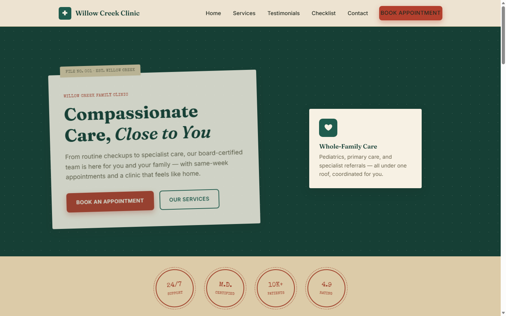

# Willow Creek Family Clinic

A single-page marketing site for a healthcare clinic — hero, services, a downloadable care checklist, testimonials, and an appointment request form. Styled as "The Card Catalog": a warm, tactile visual identity built around index cards, folder tabs, and rubber-stamp badges.

🔗 **Live site:** https://mcpiero77-ai.github.io/healthcare/



## Overview

The entire site (markup, styles, and behavior) lives in one self-contained file, [`index.html`](index.html). There's no build step, no package manager, and no dependencies beyond a Google Fonts link.

Sections, top to bottom:

- **Navbar** — sticky header with smooth-scroll anchor links and a mobile hamburger menu
- **Hero** — intro banner
- **Services** — clinic offerings
- **Checklist** — email-gated lead magnet (a downloadable preventive-care checklist)
- **Testimonials** — patient reviews
- **Contact** — client-side-validated appointment request form
- **Footer**

## Features

- Mobile-first responsive layout
- Scroll-triggered fade-in animations (`IntersectionObserver`, with a fallback for unsupported browsers)
- Two independently validated forms (appointment request + checklist email capture), each with inline error messages and `aria-invalid` states
- No frameworks, build tools, or dependencies

## Development

Just open `index.html` in a browser — no server required.

After making changes, manually re-check in the browser:

- Sticky nav + smooth scroll to each section
- Mobile hamburger menu at narrow widths
- Scroll fade-in animations
- Both forms (appointment request and checklist signup): empty submit, invalid email, and a valid submit (check the console-logged payload)

## Deployment

Pushes to `main` automatically deploy to GitHub Pages via the workflow in [`.github/workflows/deploy.yml`](.github/workflows/deploy.yml).

## Project structure

```
index.html   → entire site (HTML, CSS, JS)
CLAUDE.md    → guidance for AI-assisted development on this repo
```
